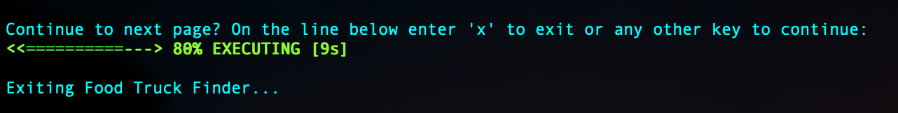

<p align="center">
  <h3 align="center">Food Truck Finder</h3>

  <p align="center">
    Find food trucks in the San Francisco area that are currently open using <a href="https://dev.socrata.com/foundry/data.sfgov.org/jjew-r69b">San Francisco government’s API</a>.
  </p>
</p>


<!-- TABLE OF CONTENTS -->
<details open="open">
  <summary><h2 style="display: inline-block">Table of Contents</h2></summary>
  <ol>
    <li>
      <a href="#about-the-project">About The Project</a>
      <ul>
        <li><a href="#built-with">Built With</a></li>
      </ul>
    </li>
    <li>
      <a href="#getting-started">Getting Started</a>
      <ul>
        <li><a href="#prerequisites">Prerequisites</a></li>
        <li><a href="#running-the-application">Running the Application</a></li>
      </ul>
    </li>
    <li><a href="#usage">Usage</a></li>
    <li><a href="#roadmap">Roadmap</a></li>
    <li><a href="#technical-write-up">Technical Write-Up</a></li>
  </ol>
</details>


<!-- ABOUT THE PROJECT -->
## About The Project


### Built With

* [Java](https://java.com)
* [Spring](https://spring.io)
* [Gradle](https://gradle.org/)


<!-- GETTING STARTED -->
## Getting Started

To get a local copy up and running follow these simple steps.

### Prerequisites

* [Gradle](https://gradle.org/install/)
  ```sh
  brew install gradle
  ```
* [Java JDK](https://adoptopenjdk.net/) version 8 or higher 
  ```sh
  java -version
  ```

### Running the Application

If using Gradle, you can run the application by using `./gradlew bootRun`. Alternatively, you can build the JAR file by using `./gradlew build` then run the jar as follows:
```sh
java -jar build/libs/FoodTruckFinder-1.0.0.jar
```
   
   
<!-- USAGE EXAMPLES -->
## Usage

_Please refer to the examples in the images_ _directory._





<!-- ROADMAP -->
## Roadmap

* Convert the application into a REST API so that it could be used as a back-end for front-end. With the application already having a Spring foundation this would be fairly simple solution.
* Add the ability for the user to enter a time range as opposed to using the user's current time converted to Pacific Standard Time.


<!-- TECHNICAL WRITE-UP -->
## Technical Write-Up

#### Web Application Conversion

When designing the conversion and scaling of a web application, the dependencies of the web app must be considered. Our main dependency, Socrata API, has a limitation of 1000 requests per rolling hour period, but we’ll assume we can exceed this.  The API offers the ability for pagination through ‘limit’ and ‘offset’ commands which allows for quick queries that do not load the server and reduce the amount of data returned to the user, consequently the time it takes to receive a response. The user isn’t interested in *all* the data, so to avoid wasting resources we can just have the user request more if needed as opposed to sending a large dataset all at once.

Converting our application from a command-line application to a web application means the user would be interacting with the app through HTTP protocol, so we could provide a parameterized endpoint that the user can interact with to pass a custom time and continue using the APIs pagination with a default endpoint that uses the system's current time at the time the user makes the request. The application would need to bring in an application web server so that it can be hosted online somewhere accessible to users via HTTP.  We are working on building one stand-alone application, so this could be part of a microservice architecture. Microservices offer many advantages such as easy deployments, minimal configurations, and the ability to scale with ease. Additionally, they are compatible with containers meaning we can use a container engine such as Docker. Packaging our application into containers allows us to define the complete application, including the JRE, configuration settings, OS-level dependencies, and build artifacts into self-contained deployable artifacts.

#### Scaling

Having our application packaged into container images makes it easy to ship since the workload is portable across all environments. To ship the containers, we can employ a container orchestrator such as Kubernetes to handle the deploying and scaling of applications as business needs dictate. When we consider our app is dependent on results of open food trucks requests, we know that our key load parameter for scalability is the distribution of requests per user where some users may fetch more data than others. To address issues with the load we can maintain a cache of open food trucks when requested, so that whenever a user requests that information it is a cheap request because the results have already been retrieved ahead of time. Other things to consider would be the set-up of detailed and clear monitoring, such as performance metrics and error rates.  These metrics can be invaluable in finding issues when a problem occurs, often providing early warning signs of any service degradation.
